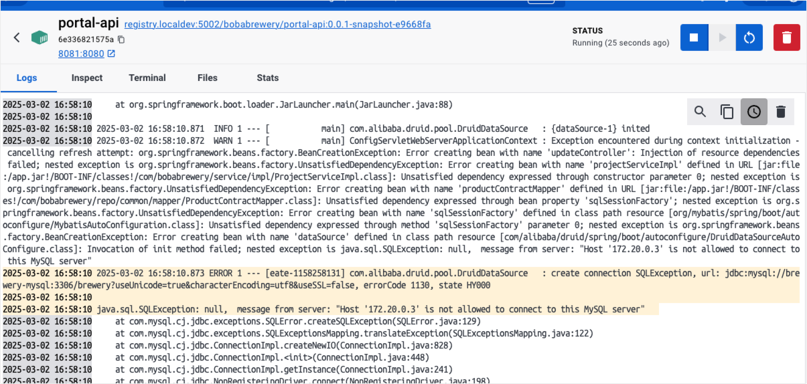

# 后端服务构建部署说明
## 0. 前置条件

需要确保在开发环境中安装好 jdk8, maven(3.6.3+) && docker(20.10.17+) 和 docker compose(高版本docker安装时自带,低版本需要自行安装)

## 1. 数据库

    MySQL 5.7.29

    存储引擎：INNODB
    字符集编码：utf8mb4


| 数据库名    | 用户名  | 密码   |
|---------|------| ------ |
| brewery | root | 123456 |


应用列表：

| 服务名           | 开放端口 |
|---------------|------|
| portal-api    | 8080 |
| MySQL（5.7.29） | 3306 |


## 2.本地构建 && 镜像打包：

### 2.1 构建 portal-api 服务镜像
    
    cd c2n-be

    # 打包后端服务
    mvn clean install -Dmaven.test.skip=true

    # 构建容器镜像
    cd portal-api
    ./docker-build.sh

### 2.2 生成接口文档

    cd c2n-be

    mvn -Dfile.encoding=UTF-8 smart-doc:html

    在 portal-api/docs/html 目录下生成 debug-all.html 文件，使用浏览器打开查看接口文档。
    
    在portal-api/docs/html-example目录下保存了一份示例，供前端调用。
    


### 2.3 配置修改

#### 2.3.1 新建配置文件    

    cd deployment/docker-env
    
    #复制
    cp portal-api.env.example portal-api.env

#### 2.3.2 修改配置文件 portal-api.env

配置样例如下:
```shell
SPRING_PROFILES_ACTIVE=dev
TZ=Asia/Shanghai

# 私钥
OWNER_PRIVATE_KEY=privatekey

# mysql 数据库配置
DB_HOST=brewery-mysql:3306
DB_NAME=brewery
DB_USERNAME=root
DB_PWD=123456

```

以上配置中，
OWNER_PRIVATE_KEY 的值需改为私钥内容。
私钥格式：OWNER_PRIVATE_KEY=702b0c8d127e662aff3fbdba0e797b6598f50cc8712230be8791963412345678
DB_XXX 配置为数据库配置，无需修改，如果使用外部数据库可以自行改为对应配置内容。


### 2.4 启动服务
    cd delpoyment 
    docker compose up -d 
    或者
    docker-compose up -d  # 使用低版本docker时，单独安装的 docker-compose 时使用

    # 查看服务启动日志
    docker-compose logs -f
> 服务报错问题：

解决办法：
查找AI助手，修改mysql root权限  
```
# 进入MySQL容器
docker exec -it brewery-mysql bash

# 在容器内登录MySQL
mysql -uroot -p123456

# 在MySQL内执行以下命令授予权限
mysql> CREATE USER 'root'@'%' IDENTIFIED BY '123456';
mysql> GRANT ALL PRIVILEGES ON *.* TO 'root'@'%' WITH GRANT OPTION;
mysql> FLUSH PRIVILEGES;
mysql> exit

# 退出容器
exit
```  
`补充说明： 为了方便项目的部署，启动的时候监听了hardhat 销售工厂的事件，只要销售工厂发生了变更的化，会把代币销售合约的参数同步到链下，使用数据库存起来。好处就是ETH的性能不够好，像这种销售方案被频繁访问的过程数据，通常会从链上同步到链下做本地存储，提升数据访问性能。在spring 后端工程也做了消息同步的模块`

### 手动同步数据
如果没有进行销售方案同步的话，就需要做一次手动的同步。

    cd c2n-be/utils
    sh generate_update_data.sh [json_file] [server_url] 
    
    命令样例如下：
    sh generate_update_data.sh '{"saleAddress":"0x8aCd85898458400f7Db866d53FCFF6f0D49741FF","saleToken":"0x959922bE3CAee4b8Cd9a407cc3ac1C251C2007B1","saleOwner":"0xf39Fd6e51aad88F6F4ce6aB8827279cffFb92266","tokenPriceInEth":"100000000000","totalTokens":"10000000000000000000000000","saleEndTime":1740985165,"tokensUnlockTime":1740985395,"registrationStart":1740984975,"registrationEnd":1740985095,"saleStartTime":1740985105}' localhost:8081

`server_url:`  localhost:8081  端口我是修改了的，本地8080被微信占用了

`json_file:`  是部署合约 make ido 之后，生成的数据

执行成功之后，就会更新本地链上的销售方案，但是现在我们是进行的监听时间，因此这一步就不需要执行了。


