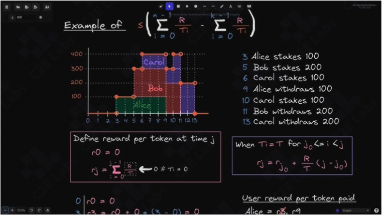
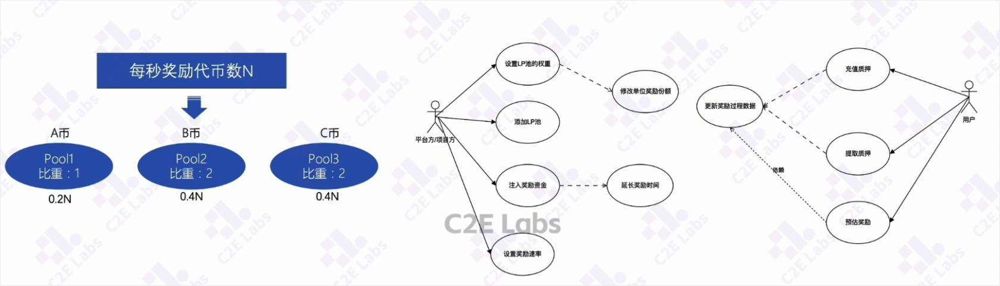
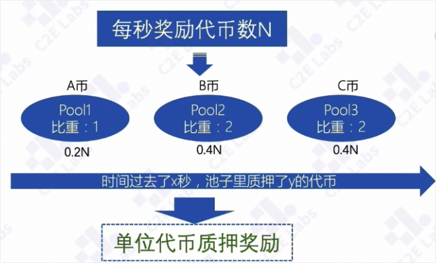
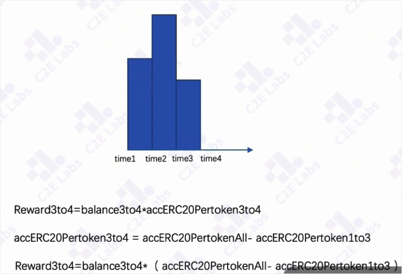

# Farming
farming 是web3 领域中独特的概念，指的是投资者（用户）将自己的代币只要给defi平台，平台根据质押的数量给予相应的回报，通常是defi平台的代币。
defi平台还可以将质押的货币租借给其他的投资者，下面看一下质押的过程中的具体例子。

- 第3秒，alice 质押了 100代币，
    - 3-5秒 alice独享代币的回报
- 第5秒，bob 质押200
    - 5-6秒，alice + bob共享代币池的奖励
- 第6秒，carol质押100代币
    - 6-9， alice+bob +carol共享代币池的奖励
- 第9秒，alice提取了100代币，
    - 9-11秒，alice+bob共享代币池的奖励
- ...
    - 11秒之后 bob 独享
- 第13秒，carol 提取了200代币

## 算法难度
1. 以太坊无法通过cron的机制定时计算收益
2. 任意用户的充值和提取都影响分配的比例
3. 时间变化会影响用户的分配，但又无法保存每一次变化的结果

代币池

特点1，平台方允许质押多种代币，只不过每种质押的权重不一样，根据每秒奖励代币数量来计算。

## 平台方
平台方可以添加LP池，也就是可以指定哪些代币可以被质押。 
并且可以为每个LP池里面的代币设置权重，会影响到单位奖励的份额。
平台方可以设置奖励的速率，在当前项目中是构造合约的时候就写死的。
但是可以通过注入奖励资金，延长奖励的时间。 

## 用户方
用户可以充值质押代币，提取质押代币，以及预估自己的奖励。
因为奖励份额是（用户质押的数量/池中所有流动性的供应量）因此，每次充值\提取都会更新我们奖励的过程数据。
预估奖励则会依赖这个过程数据。

## 最复杂的算法点 AccERC20PerShare
如何解决不同用户在不同时间，质押/提取，对整个奖励的影响，以及时间对整个奖励的影响。
Staking算法巧妙地通过"单位token获取的奖励"来代替"单位时间获取的奖励"以此规避了复杂的时间变化.

上一张图定义好了每秒奖励的代币数量的时候，根据不同代币的权重，得到了每1秒可以分配到的奖励。这张图是0.2N 0.4N 0.4N。

问题，时间过去了x秒，池子里面质押了y个代币，用户应该获得多少奖励？
我们通过单位代币质押奖励涵盖了以上所有的参数，过去的这一段时间，每一个代币能够分配给多少的质押奖励，作为基础数据，再乘以这段时间内用户质押余额。就得到了用户在这段时间内用户应该分配的奖励。

accERC20PerShare： 每一份质押的代币，在一段时间可以获得多少的奖励

uint256 erc20Reward = nrOfSeconds.mul(rewardPerSecond).mul(pool.allocPoint).div(totalAllocPoint); 
> - nrOfSeconds 上一次记录到现在的时间
> - rewardPerSecond 每一秒获得的奖励
> - allocPoint/totalAllocPoint 配额，当前池子的比重/总池子的比重，也就是0.2N ...

上面的公式就是 时间 * 每秒的奖励 * 比重， 得到代币的奖励

如何计算用户应该拿到的奖励？
用代币的奖励/代币池总的流动性供应量=每一份代币应分得的奖励
这个奖励是指的这段时间的奖励，这段时间每一份质押代币应分得的奖励
pool.accERC20PerShare = pool.accERC20PerShare.add(erc20Reward.mul(1e36).div(lpSupply);

> 1e36 1*10**36 大数原理，解决小数计算问题

accERC20PerShare=F(second, rewardRatge, allocPoint, lpsupply)

时间、速率、分配权重、总供应量的函数，就将时间包含到了这个函数中，剥离了用户余额，后面通过用户余额*accERC20PerShare 就得到了当前应该获取的奖励

## 理解难点2：rewardDebt
利用累计减历史的方式，来解决reward增量变化过程中数据频繁变化的问题，可以减少状态变量的存储。

t1时间质押了一定数量的代币；
t2时间增加了质押代币；
t3时间减少质押数量；
如果我们计算3-4秒用户质押的代币的奖励，如何计算？
Reward3to4 = balance3to4 * accERC20Pertoken3to4
3-4秒的余额 * 3-4秒时间每代币应该的奖励

3-4秒时间每代币应该的奖励 = 1-4秒（总时间）每代币应奖励数 - 1-3秒每代币应奖励数
accERC20Pertoken3to4= accERC20PertokenAll - accERC20Pertoken1to3

用户3-4秒的奖励数量 就可以用三个变量来实现
余额 * 总的代币奖励（每次变化都要更新）- 历史（1-3秒）已经计算过的代币奖励（在withDraw 和deposit的时候进行累加）
Reward3to4= balance3to4 * （accERC20PertokenAll- accERC20Pertoken1to3）

公式如下：

uint256 pendingAmount = user.amount * pool.accERC20PerShare / (1e36) * (user.rewardDebt); 
> user.amount 用户余额
> accERC20PerShare 累计的每代币奖励
> user.rewardDebt 历史上已经奖励的金额（1-3秒）

对公式进行展开：
//用户充值的代币数增加amount
user.amount = user.amount + (_amount);
//累计到现在已经提取的收益
user.rewardDebt =user.amount * (pool.accERC 20PerShare) / (1e36);

uint256 pendingAmount = user.amount * pool.accERC20PerShare /  user.amount * (pool.accERC20PerShare) ; 