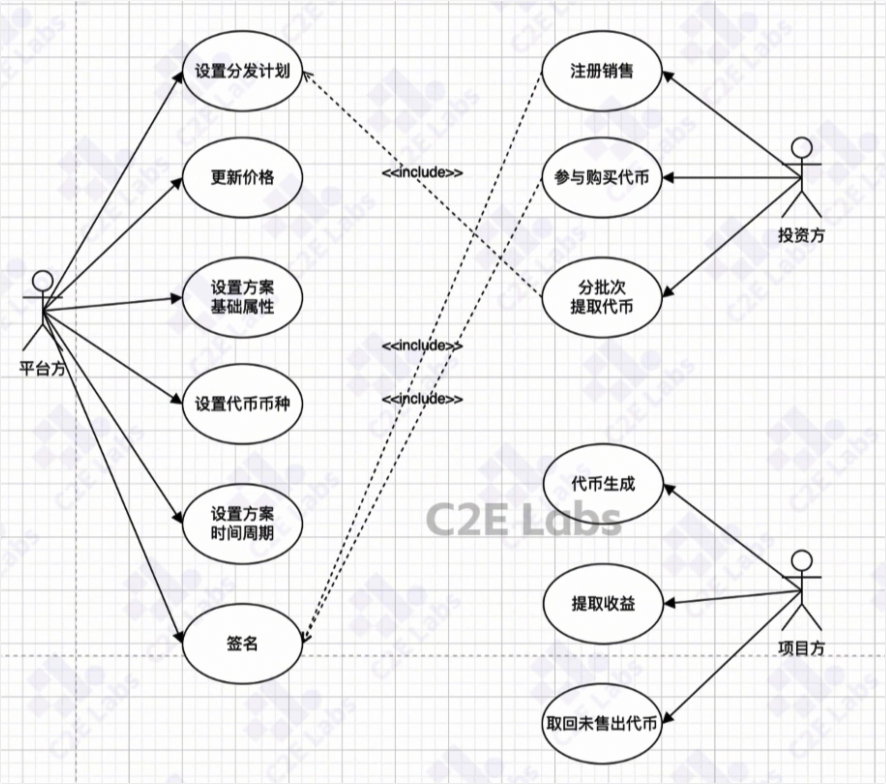
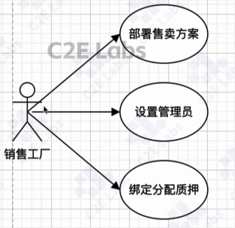

# Sales合约

sales合约是过程最长的合约，因此理解该合约需要理解比较重要的几个用例。

依然存在平台方、投资方、项目方存在，
项目方向平台方提出代币发行计划之后，**平台方**根据实际情况设置代币发行计划，也就是投资方（用户）在代币解锁之后，投资方能够按照什么比例住批次的领取自己的代币。

**平台方**：可以设置代币价格，方案基础属性，代币币种，方案周期，签名（投资方在注册、销售、购买过程）。

**投资方**：注册销售，参与购买代币，分批次提取代币。

**项目方**：生成代币，提取收益，取回未销售出的代币。

## 销售工厂

平台方用于生成销售方案的合约，部署销售方案， 设置管理员， 绑定分配质押（会在分配质押章节介绍）。

合约路径如下
c2n-contracts/contracts/sales/C2NSale.sol
c2n-contracts/contracts/sales/SalesFactory.sol
