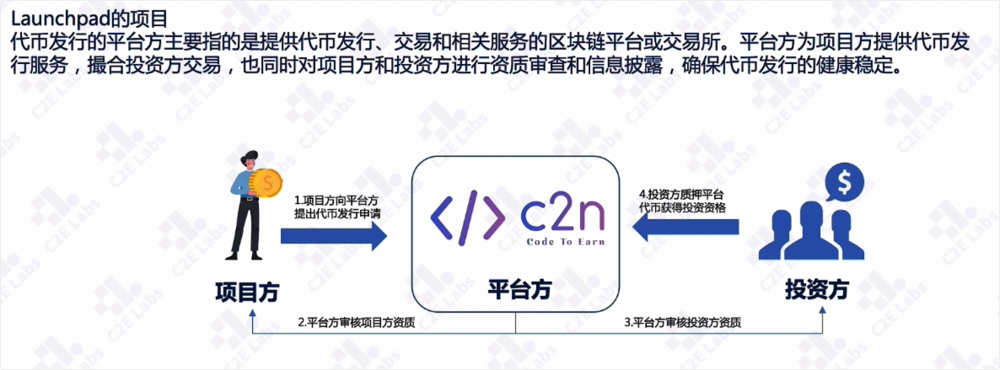
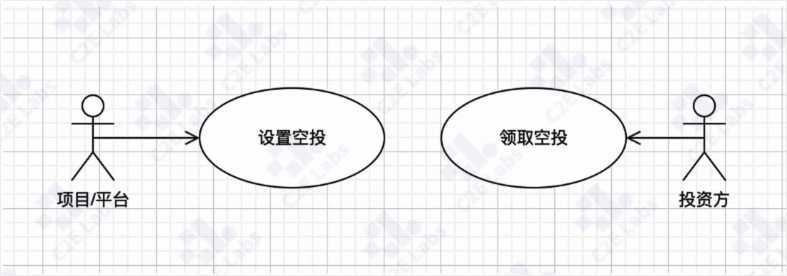
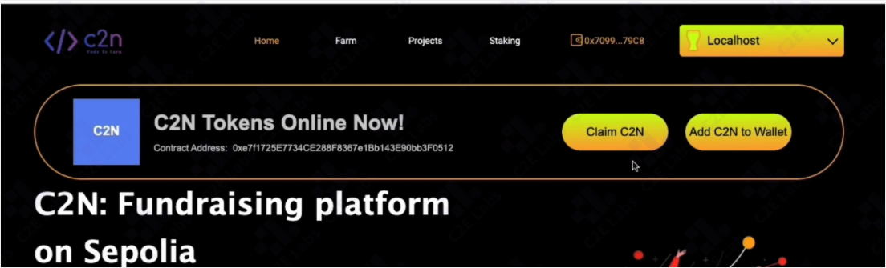
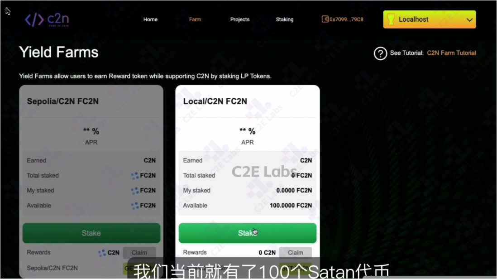
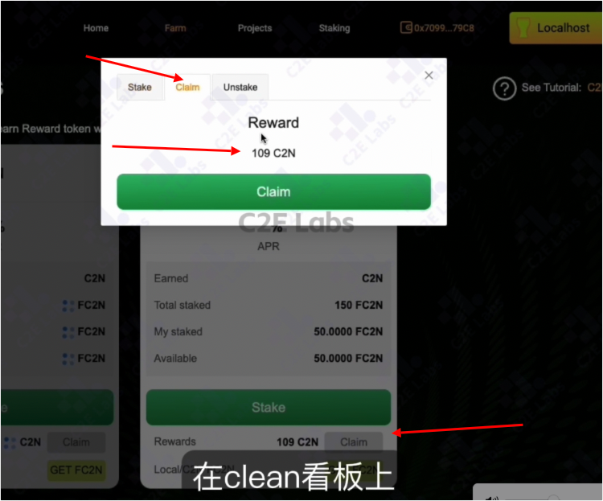
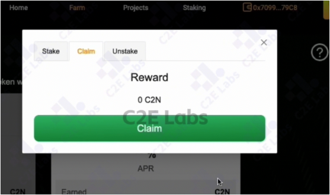

# 声明
该项目仅用于教学用途，不存在商业用途。

# 项目背景 需求描述
基于社区发展和学员学习进阶需要，C2N社区推出启动台项目。整体项目定位是社区基础项目发行平台。
项目除了满足学习用途，更加鼓励同学在平台贡献自己的智慧和代码。


内部版本没有kyc，注册流程
C2N launchpad是一个区块链上的一个去中心化发行平台，专注于启动和支持新项目。它提供了一个平台，允许新的和现有的项目通过代币销售为自己筹集资金，同时也为投资者提供了一个参与初期项目投资的机会。

项目发展一共分为三个阶段：（可以忽略）
#### 第一阶段：学习和任务阶段，C2N技术团队和社区同学一起迭代该项目（4-5月份）
#### 第二阶段：社区内部项目孵化阶段，满足社区同学发挥团队的创造力（6月份开始）
#### 第三阶段：外部合作和开源发展阶段（待定）

# 演示地址（功能部分不可用）
https://c2-n-launchpad.vercel.app/

# 名词解释+生命周期
## 名词
- 平台方：代币发行的平台方指提供代币发行、交易、相关服务的区块链平台或者交易所。平台方为项目方提供代币发行服务，撮合投资方交易，也对项目方、投资方进行审查和信息披露，确保代币发行的健康稳定。
- 项目方：向平台方提供代币发行申请的项目|团队，提供白皮书、智能合约、代币分发计划的材料给平台审核，平台通过审核通过平台发行项目方代币。
- 投资方：项目方代币的购买者，成为购买者需要一定的门槛，需要在项目中质押一定数量的平台代币作为参与购买代币的条件
- 平台代币：平台方发行的代币，本项目中为C2N代币
- 项目代币：项目方申请发行的代币，本项目中MCK代币
- 质押：投资方将自己的平台方代币质押给平台方，在本项目中作为参与项目的条件
## 生命周期
准备期  -> 投资注册期  -> 等待销售开始 -> 项目销售  -> 售后锁定期  -> 代币解锁期
 ### 准备期
申请：项目方提交代币发行申请，例如代币合约、白皮书等。
审核：平台方会进行审核
投资方在这里可以提前质押一些代币，确保IDO（Initial DEX Offering，初始去中心化交易所发行） 可以参与代币购买。剩下就是等待注册的开始。
我们会通过一系列的脚本来完成注册期的准备。  

### 注册期
准备期过后，投资者可以选择自己喜欢的IDO项目，进行投资注册，当然需要提前质押一定数量的代币来获得注册的权限。
注册完成，平台方会对投资者进行资质审查，也就是KYC验证。
- 白名单：完成KYC的投资者可能需要被添加到白名单中，才能在代币销售中购买代币。

### 等待销售开始
审核通过，投资者就进入了销售等待，等待期内平台方会审查、信息披露等。

### 销售
投资者可以购买自己选择的代币，本项目项目代币是MCK token，本项目使用ETH来进行购买。
购买完成后，不会立刻发送到投资者的钱包里面，而是等待代币生成事件。

### 销售锁定
平台会进行最后的审查，项目方会准备好需要发行的代币（代币生成事件），平台方会将项目方的代币充值到代币池，投资方只需要等待代币生成，本项目也是使用脚本来完成代币生成事件。

### 代币解锁
投资者就可以提取自己的代币了。可以在面板上看到投资者参与的信息。


# 重点合约- airdrop

项目方向选定的钱包地址或者符合条件的用户分发新代币（Token)的过程。
目的早期宣传项目产品和积累用户。

在farm页面就能看到领取的100C2N代币

然后可以进行stake质押代币操作,在小狐狸钱包上进行批准确认，这时候收益就已经在后台自动计算了。收益是在withdraw 和deposit的时候进行计算的。

操作流程是
- 切换到另外一个账户，质押操作，例如100C2N代币
- 切换回第一个账号，点击claim进行领取，就会看到已经有奖励金额在了

为什么需要切换到另外一个账号进行充值？
任何一个用户的充值提取都会影响整个代币的奖励速度，也会影响其他用户代币奖励的金额。
继续进行claim， 只看到了0个收益，但点击确认，唤起小狐狸，执行交易，收益依然在增加。因为收益是在后台自动计算的。因此前台没有看到收益，点击确认收益依然会增加



# 重点合约- framing
投资者将自己的代币质押给平台，defi平台将质押的代币数量给予回报，一般是defi平台代币。defi也可以将其他用户质押的代币，租借给其他的投资人。


# 代码结构
前端： c2n-fe
后端： c2n-be
合约： c2n-contracts
DEPLOY.md 快速部署的流程

## c2n-contracts
集成了hardhat框架，因此需要启动hardhat环境。也集成了openzeppelin框架，可以使合约更简洁。
### contracts/access
Admin.sol 在IDO 流程中需要的管理员合约
### contracts/farming
FramingC2N.sol 收益农场
### contracts/interface
对外的一些接口

### contracts/sales
在IDO流程中需要的，分配质押（AllocationStakinig.sol) 销售合约(C2NSale.sol) 销售工厂(SalesFactory.sol)

### contracts/token
在IDO 过程中所需要的代币类的合约，例如空投、C2N代币

### deployments
部署过程中需要的abi文件，一般不动

### scripts
部署合约、升级合约需要使用到的脚本
#### scripts/deployment
 部署合约所有需要的个体脚本，所有都在这里。
 如果你有makefile环境，直接执行make ido 就可以

#### scripts/management
管理合约的功能，添加管理员 addAdmin 设置销售工厂、升级分配质押
因为lanchpad 技术栈里面，涉及 allocationStaking的时候使用的是 透明可升级合约的技术，需要的时候可以升级你的allocationStaking,就要使用这个upgradeAllocationStaking.js 脚本

### test
所有合约方法的单元测试，admin、c2n代币、销售合约的测试，所有测试都是可以跑起来的，将近200多个单元测试点，可以快速测试合约。
单元测试中也会遇到相对复杂的技术，验签的测试，将链时间进行修改的技术

## c2n-be
后端工程，使用java技术，jsk8.主要有2个功能，
1 实现了链下加签，链上验签的功能。在ido流程中，销售的注册是需要链下加签的，也就是后端完成。在链上进行验签。
2 项目启动过程，会监听链上的消息，销售变更的消息，可以实时将链上销售的流程同步到链下保存到数据库。方便用户链下通过网页端对销售方案进行访问。通常链上性能满足不了的时候会这样做

## c2n-fe
前端工程，通过yarn来进行部署。

以上就是lanchpad 项目目录的介绍。


# 项目说明
该代码仓库共分为两个项目，分别为Farm（质押挖矿,流动性挖矿）与 Sale（项目IDO)

质押挖矿（Farming）的概念

质押挖矿是指用户将流动性提供（LP）代币存入一个智能合约（称为农场，Farm）中，来获取特定的ERC20代币奖励的过程。该过程通常包括以下几个主要步骤：

    存入LP代币：
    用户将流动性提供（LP）代币存入农场合约中。存入的LP代币代表用户在去中心化交易所（如Uniswap或SushiSwap）中提供的流动性。
    
    获取奖励：
    用户根据其质押的LP代币数量和时间，按比例获得ERC20代币奖励。奖励是根据区块时间或秒计算的。
    
    提取LP代币和奖励：
    用户可以随时提取其质押的LP代币，并获取其累积的ERC20代币奖励。

合约中的具体运作机制

合约FarmingC2N具体实现了上述过程，以下是该合约的一些关键点：

    结构体：
        UserInfo：存储每个用户的质押数量和奖励债务。
        PoolInfo：存储每个流动性池的信息，包括LP代币合约地址、分配点数、最后奖励计算时间、每股累积的ERC20奖励和总质押数量。
    
    核心变量：
        erc20：奖励代币的合约地址。
        rewardPerSecond：每秒奖励的ERC20代币数量。
        startTimestamp和endTimestamp：质押挖矿的开始和结束时间。
        totalRewards：农场总奖励的ERC20代币数量。
        totalAllocPoint：所有流动性池的总分配点数。
    
    主要函数：
        fund：向农场添加奖励代币，并延长质押挖矿的结束时间。
        add：添加新的流动性池。
        set：更新流动性池的分配点数。
        deposit：用户存入LP代币并更新其奖励。
        withdraw：用户提取LP代币并获取奖励。
        emergencyWithdraw：紧急情况下，用户可以提取其所有质押的LP代币，但不会获取奖励。
        pending：查看用户的待领取奖励。
        updatePool和massUpdatePools：更新流动性池的奖励变量。

操作流程示例

    管理员添加奖励代币：
    管理员调用fund函数向农场添加奖励代币，并设置结束时间。
    
    用户质押LP代币：
    用户调用deposit函数，将LP代币存入农场。
    
    用户获取奖励：
    用户调用withdraw函数，提取其质押的LP代币并获取相应的ERC20代币奖励。
    
    紧急提取：
    在紧急情况下，用户可以调用emergencyWithdraw函数，提取所有质押的LP代币，但不会获取任何奖励。

通过这个智能合约，质押挖矿提供了一种激励机制，使用户能够通过提供流动性来获得额外的代币奖励。


# Farm 部署流程

1. 复制.env.example 到.env,修改PRIVATE_KEY, 要求arbitrum sepolia上有测试eth

2. 部署c2n token
   `npx hardhat run scripts/deployment/deploy_c2n_token.js --network sepolia`

3. 部署airdrop合约
   `npx hardhat run scripts/deployment/deploy_airdrop_c2n.js --network sepolia`

4. 修改前端地址，运行前端测试airdrop功能


进入前端目录c2n-fe，安装依赖
`yarn`

修改token地址和airdrop合约地址为合约之前部署的两个地址，如下：

c2n-fe/src/config/index.js 中的
`AIRDROP_TOKEN_ADDRESS_MAP` 的 31337（本地链端口）地址修改为C2N-TOKEN的地址
`AIRDROP_CONTRACT` Airdrop-C2N的地址

运行项目
`yarn dev`

修改前端本地链地址
默认本地链rpc地址为：http://127.0.0.1:8545
链ID为31337
c2n-fe/src/util/chain_id.ts
c2n-fe/src/config/valid_chains.js
如有更换，在这两个文件中修改本地链ID和rpc地址

6. farm

修改c2n-contracts/scripts/deployment/deploy_farm.js
第7行startTS为3分钟之后（必须是当前时间之后，考虑上链网络延迟）

修改 c2n-fe/src/config/farms.js
depositTokenAddress和earnedTokenAddress为AIRDROP_TOKEN的地址
修改stakingAddress为部署的farm合约地址：地址在\c2n-contracts\scripts\deployment\deploy_farm.js\里面有日志，盯着点

部署完毕，可以使用账号体验farm功能

## 具体操作
1. Farm 流程需要用到我们的Erc20测试代币C2N, 可以在首页领取C2N(一个账户只能领取一次),并且添加到我们metamask，添加之后我们可以在metamask 看到我们领取的C2N 代币

2. 在我们farm界面，我们可以质押fc2n 代币获取c2n, (方便大家操作，我们的测试网fc2n，c2n 是在上一步中领取的同一代币)，在这里我们有三个操作，stake:质押，unstake(withdraw):撤回质押， 以及 claim:领取奖励;

点击stake 或者claim 进入对应的弹窗，切换tab可以进行对应的操作；
3. Stake ，输入要质押的FC2N代币数量，点击stake 会唤起钱包，在钱包中confirm，然后等待交易完成；

我们新增质押了1FC2N,交易完成之后我们会看到，My staked 从0.1 变成1.1;
Total staked 的更新是一个定时任务，我们需要等待一小段时间之后才能看到更新

3. Claim 领取质押奖励的C2N,点击claim 并且在钱包确认

交易完成后我们会看到Available的FC2N数量增加了96，钱包里面C2N的代币数量同样增加了96

4. Unstake(withdraw),输入需要撤回的FC2N 数量(小于已经质押的Balance)，点击withdraw，并且在钱包确认交易

unstake 完成后我们可以看到my staked 的数量变为0


# 学员任务
为了帮助学员逐步完成以太坊智能合约C2N Launchpad开发的学习任务，下面我将根据合约代码，拆分出一系列循序渐进的开发任务，并提供详细的文档。这将帮助学员理解并实践如何构建一个基于以太坊的农场合约（Farming contract），用于分配基于用户质押的流动性证明（LP tokens）的ERC20代币奖励。

## 概述
FarmingC2N合约是一个基于以太坊的智能合约，主要用于管理和分发基于用户质押的流动性证明(LP)代币的ERC20奖励。该合约允许用户存入LP代币，并根据质押的数量和时间来计算和分发ERC20类型的奖励。
开发任务拆分
## 任务一：了解基础合约和库的使用
1. 阅读和理解OpenZeppelin库的文档：熟悉IERC20、SafeERC20、SafeMath、Ownable这些库的功能和用途。
2. 创建基础智能合约结构：根据openZeppelin 库，导入上述合约。
## 任务二：用户和池子信息结构定义
1. 定义用户信息结构（UserInfo）：
  - 学习如何在Solidity中定义结构体。
  - 定义uint256类型的 amount,和uint256 rewardDebt字段
在后续实现中会根据用户信息进行一些数学计算。
```
说明：在任何时间点，用户获得但还尚未分配的 ERC20 数量为：
pendingReward = (user.amount * pool.accERC20PerShare) - user.rewardDebt
每当用户向池中存入或提取 LP 代币时，会发生以下情况：
1. 更新池的 `accERC20PerShare`（和 `lastRewardBlock`）。
2. 用户收到发送到其地址的待分配奖励。
3. 用户的 `amount` 被更新。
4. 用户的 `rewardDebt` 被更新。
```
2. 定义池子信息结构（PoolInfo）：
  - 理解并定义池子信息，包括LP代币地址、分配点、最后奖励时间戳等。

参考答案：
```
struct UserInfo {
    uint256 amount;  
    uint256 rewardDebt; 
}
struct PoolInfo {
    IERC20 lpToken;             // Address of LP token contract.
    uint256 allocPoint;         // How many allocation points assigned to this pool. ERC20s to distribute per block.
    uint256 lastRewardTimestamp;    // Last timstamp that ERC20s distribution occurs.
    uint256 accERC20PerShare;   // Accumulated ERC20s per share, times 1e36.
    uint256 totalDeposits; // Total amount of tokens deposited at the moment (staked)
}
```

## 任务三：合约构造函数和池子管理
首先我们先定义一些状态变量
- erc20：代表ERC20奖励代币的合约地址。
- rewardPerSecond：每秒产生的ERC20代币奖励数量。
- totalAllocPoint：所有矿池的分配点总和。
- poolInfo：所有矿池的数组。
- userInfo：记录每个用户在每个矿池中的信息。
- startTimestamp和endTimestamp：奖励开始和结束的时间戳。
- paidOut：已经支付的奖励总额。
- totalRewards：总的奖励额。
1. 编写合约的构造函数：
  - 初始化ERC20代币地址、奖励生成速率和起始时间戳。
2. 实现添加新的LP池子的功能（add函数）：
  - 按照poolInfo的结构，添加一个pool，并指定是否需要批量update合约资金信息
  - 注意判断lastRewardTimestamp逻辑，如果大于startTimestamp，则为当前块高时间，否则还未开始发放奖励，设置为startTimestamp
  - 学习权限管理，确保只有合约拥有者可以添加池子。

参考答案：
```
constructor(IERC20 _erc20, uint256 _rewardPerSecond, uint256 _startTimestamp) public {
    erc20 = _erc20;
    rewardPerSecond = _rewardPerSecond;
    startTimestamp = _startTimestamp;
    endTimestamp = _startTimestamp;
}

function add(uint256 _allocPoint, IERC20 _lpToken, bool _withUpdate) public onlyOwner {
    if (_withUpdate) {
        massUpdatePools();
    }
    uint256 lastRewardTimestamp = block.timestamp > startTimestamp ? block.timestamp : startTimestamp;
    totalAllocPoint = totalAllocPoint.add(_allocPoint);
    poolInfo.push(PoolInfo({
    lpToken : _lpToken,
    allocPoint : _allocPoint,
    lastRewardTimestamp : lastRewardTimestamp,
    accERC20PerShare : 0,
    totalDeposits : 0
    }));
}
```

## 任务四：fund功能实现
合约的所有者或授权用户可以通过此函数向合约注入ERC20代币，以延长奖励分发时间。
需求：
1. 确保合约在当前时间点仍可接收资金，即未超过奖励结束时间
2. 从调用者账户向合约账户安全转移指定数量的ERC20代币
3.  根据注入的资金量和每秒奖励数量，计算并延长奖励发放的结束时间
4.  更新合约记录的总奖励量
参考答案
```
function fund(uint256 _amount) public {
    require(block.timestamp < endTimestamp, "fund: too late, the farm is closed");
    erc20.safeTransferFrom(address(msg.sender), address(this), _amount);
    endTimestamp += _amount.div(rewardPerSecond);
    totalRewards = totalRewards.add(_amount);
}
```

## 任务五：核心功能开发，奖励机制的实现
编写更新单个池子奖励的函数（updatePool）：
- 理解如何计算每个池子的累计ERC20代币每股份额。
- 需求说明: 该函数主要功能是确保矿池的奖励数据是最新的，并根据最新数据更新矿池的状态，需要实现以下功能：
  1. 更新矿池的奖励变量
  updatePool需要针对指定的矿池ID更新矿池中的关键奖励变量，确保其反映了最新的奖励情况。这包括：
  - 更新最后奖励时间戳： 如果池子还未结束，将矿池的lastRewardTimestamp更新为当前时间戳，以确保奖励的计算与时间同步，否则lastRewardTimestamp = endTimestamp
  - 计算新增的奖励：根据从上次奖励时间到现在的时间差，结合矿池的分配点数和全局的每秒奖励率，计算此期间应该新增的ERC20奖励量。
  2. 累加每股累积奖励
  根据新计算出的奖励量，更新矿池的accERC20PerShare（每股累积ERC20奖励）：
  - 奖励分配：将新增的奖励量按照矿池中当前LP代币的总量（totalDeposits）进行分配，计算出每份LP代币所能获得的奖励，并更新accERC20PerShare。
  3. 确保时间和奖励的正确性
  处理边界条件，确保在计算奖励时，各种时间点和奖励量的处理是合理和正确的：
  - 时间边界处理：如果当前时间已经超过了奖励分配的结束时间（endTimestamp），则需要相应调整逻辑以防止奖励超发。
  - LP代币总量检查：如果矿池中没有LP代币（totalDeposits为0），则不进行奖励计算，直接更新时间戳。
  参考实现：
```
function updatePool(uint256 _pid) public {
    PoolInfo storage pool = poolInfo[_pid];
    uint256 lastTimestamp = block.timestamp < endTimestamp ? block.timestamp : endTimestamp;

    if (lastTimestamp <= pool.lastRewardTimestamp) {
        return;
    }
    uint256 lpSupply = pool.totalDeposits;

    if (lpSupply == 0) {
        pool.lastRewardTimestamp = lastTimestamp;
        return;
    }

    uint256 nrOfSeconds = lastTimestamp.sub(pool.lastRewardTimestamp);
    uint256 erc20Reward = nrOfSeconds.mul(rewardPerSecond).mul(pool.allocPoint).div(totalAllocPoint);

    pool.accERC20PerShare = pool.accERC20PerShare.add(erc20Reward.mul(1e36).div(lpSupply));
    pool.lastRewardTimestamp = block.timestamp;
}
```
1. 实现用户存入和提取LP代币的功能（deposit和withdraw函数）：
  - 理解如何更新用户的amount和rewardDebt。
    - Deposit: 函数允许用户将LP代币存入指定的矿池，以参与ERC20代币的分配。
      - 更新矿池奖励数据：调用updatePool函数，保证矿池数据是最新的，确保奖励计算的正确性。
      - 计算并发放挂起的奖励：如果用户已有存款，则计算用户从上次存款后到现在的挂起奖励，并通过erc20Transfer发放这些奖励。
      - 接收用户存款：通过safeTransferFrom函数，从用户账户安全地转移LP代币到合约地址。
      - 更新用户存款数据：更新用户在该矿池的存款总额和奖励债务，为下次奖励计算做准备。
      - 记录事件：发出Deposit事件，记录此次存款操作的详细信息。
    - Withdraw
      - 更新矿池奖励数据：调用updatePool函数更新矿池的奖励变量，确保奖励的准确性。
      - 计算并发放挂起的奖励：计算用户应得的挂起奖励，并通过erc20Transfer将奖励发放给用户。
      - 提取LP代币：安全地将用户请求的LP代币数量从合约转移到用户账户。
      - 更新用户存款数据：更新用户的存款总额和奖励债务，准确记录用户的新状态。
      - 记录事件：发出Withdraw事件，记录此次提款操作的详细信息。
      参考答案：
```
// Deposit LP tokens to Farm for ERC20 allocation.
function deposit(uint256 _pid, uint256 _amount) public {
    PoolInfo storage pool = poolInfo[_pid];
    UserInfo storage user = userInfo[_pid][msg.sender];

    updatePool(_pid);

    if (user.amount > 0) {
        uint256 pendingAmount = user.amount.mul(pool.accERC20PerShare).div(1e36).sub(user.rewardDebt);
        erc20Transfer(msg.sender, pendingAmount);
    }

    pool.lpToken.safeTransferFrom(address(msg.sender), address(this), _amount);
    pool.totalDeposits = pool.totalDeposits.add(_amount);

    user.amount = user.amount.add(_amount);
    user.rewardDebt = user.amount.mul(pool.accERC20PerShare).div(1e36);
    emit Deposit(msg.sender, _pid, _amount);
}

// Withdraw LP tokens from Farm.
function withdraw(uint256 _pid, uint256 _amount) public {
    PoolInfo storage pool = poolInfo[_pid];
    UserInfo storage user = userInfo[_pid][msg.sender];
    require(user.amount >= _amount, "withdraw: can't withdraw more than deposit");
    updatePool(_pid);

    uint256 pendingAmount = user.amount.mul(pool.accERC20PerShare).div(1e36).sub(user.rewardDebt);

    erc20Transfer(msg.sender, pendingAmount);
    user.amount = user.amount.sub(_amount);
    user.rewardDebt = user.amount.mul(pool.accERC20PerShare).div(1e36);
    pool.lpToken.safeTransfer(address(msg.sender), _amount);
    pool.totalDeposits = pool.totalDeposits.sub(_amount);

    emit Withdraw(msg.sender, _pid, _amount);
}
```

## 任务六：紧急提款和奖励分配
1. 实现紧急提款功能（emergencyWithdraw函数）：
  - 让用户在紧急情况下提取他们的LP代币，但不获取奖励。
2. 实现ERC20代币转移的内部函数（erc20Transfer）：
  - 确保奖励正确支付给用户。
参考答案：
```
// Withdraw without caring about rewards. EMERGENCY ONLY.
function emergencyWithdraw(uint256 _pid) public {
    PoolInfo storage pool = poolInfo[_pid];
    UserInfo storage user = userInfo[_pid][msg.sender];
    pool.lpToken.safeTransfer(address(msg.sender), user.amount);
    pool.totalDeposits = pool.totalDeposits.sub(user.amount);
    emit EmergencyWithdraw(msg.sender, _pid, user.amount);
    user.amount = 0;
    user.rewardDebt = 0;
}

// Transfer ERC20 and update the required ERC20 to payout all rewards
function erc20Transfer(address _to, uint256 _amount) internal {
    erc20.transfer(_to, _amount);
    paidOut += _amount;
}
```
## 任务七：合约测试和部署
1. 编写测试用例：
  - 使用Hardhat的框架进行合约测试。
2. 部署合约到测试网络（Sepolia）：
  - 学习如何在公共测试网络上部署和管理智能合约。

## (选做) 前端集成和交互
1. 开发一个简单的前端应用：
  - 使用Web3.js或Ethers.js与智能合约交互。
2. 实现用户界面：
  - 允许用户通过网页界面存入、提取LP代币，查看待领取奖励。

# 任务重难点分析

在上述的智能合约代码中，奖励机制的核心功能围绕着分配ERC20代币给在不同流动性提供池（LP pools）中质押LP代币的用户。这个过程涉及多个关键步骤和计算，用以确保每个用户根据其质押的LP代币数量公平地获得ERC20代币奖励。下面将详细解释这个奖励机制的实现过程。
## 奖励计算原理
1. 用户信息（UserInfo）和池子信息（PoolInfo）：
  - UserInfo 结构存储了用户在特定池子中质押的LP代币数量（amount）和奖励债务（rewardDebt）。奖励债务表示在最后一次处理后，用户已经计算过但尚未领取的奖励数量。
  - PoolInfo 结构包含了该池子的信息，如LP代币地址、分配点（用于计算该池子在总奖励中的比例）、最后一次奖励时间戳、累计每股分配的ERC20代币数（accERC20PerShare）等。
2. 累计每股分配的ERC20代币（accERC20PerShare）的计算：
  - 当一个池子接收到新的存款、提款或奖励分配请求时，系统首先调用updatePool函数来更新该池子的奖励变量。
  - 计算从上一次奖励到现在的时间内，该池子应分配的ERC20代币总量。这个总量是基于时间差、池子的分配点和每秒产生的奖励量来计算的。
  - 将计算出的奖励按照池子中总LP代币数量平分，更新accERC20PerShare，确保每股的奖励反映了新加入的奖励。
3. 用户奖励的计算：
  - 当用户调用deposit或withdraw函数时，合约首先计算用户在这次操作前的待领取奖励。
  - 待领取奖励是通过将用户质押的LP代币数量乘以池子的accERC20PerShare，然后减去用户的rewardDebt来计算的。这样可以得到自上次用户更新以来所产生的新奖励。
  - 用户完成操作后，其amount（如果是存款则增加，如果是提款则减少）和rewardDebt都将更新。新的rewardDebt是用户更新后的LP代币数量乘以最新的accERC20PerShare。
## 奖励发放
- 在用户进行提款（withdraw）操作时，计算的待领取奖励会通过erc20Transfer函数直接发送到用户的地址。
- 这种奖励分配机制确保了用户每次质押状态变更时，都会根据其质押的时间和数量公平地获得相应的ERC20代币奖励。
通过这种设计，智能合约能够高效且公平地管理多个LP池子中的奖励分配，使得用户对质押LP代币和领取奖励的过程感到透明和公正。


# AllocationStaking & IDO

## 流程图文详解
[分配质押&IDO流程图文详解.pdf](./分配质押&IDO流程图文详解.pdf)

## 学习目标
### 整体目标
- 掌握AllocationStaking和IDO的业务流程和对应合约代码实现
- 结合视频讲解理解业务流程，视频链接（ido讲解）
- 参考farm的学习模式，根据业务流程对应合约逻辑部分，形式不限，学习代码实现
### 合约部分
  - 合约
  - 单测
  - 部署脚本（部署过程中存储中间变量，提供后续脚本或业务访问）
### 服务端部分
  - docker容器化部署
### 前后端根据同学自身技术栈选择关注重点*（选择学习）
  - 前端学习内容
    - web3react（初始化注入钱包：src/util/web3React、业务中hook用法）
  - 后端学习内容
    - web3j（后台私钥加密解密，身份验证，签名）

### 建议同学拓展开发项目模块*
1. 后台用go重写后台逻辑（使用go-ethereum），扩展业务内容，比如通过后台监听合约事件，存储变量（目前的流程是通过脚本启动ido）
2. 前台做工程化优化（脚本、配置等可以做生产、开发模式的工程化重构），将脚本执行的业务通过页面应用形式实现等


## c2n-contacts Makefile命令解释
将脚本命令简化成了make直接可执行的命令，写到了makefile中

需要安装`make`编译工具，如果没有安装，直接执行makefile文件中的js命令也可以

命令列表：
farm流程涉及执行的命令
- farm
AllocationStaking & ido流程涉及执行的命令
- ido
- sales
- deposit
启动本地测试链
- node
运行单测
- runtest
升级合约（暂未使用）
- upgrades


# 总结-架构梳理


Base 基建层： Openzeppelin Hardhat  Ethers.js  DOcker（MySQl  Spring） 后端功能

构建层： MakeFile 批量构建脚本，dokcer 管理 mysql 和 spring， 使用js 来部署合约， json来存放业务数据，使用chai 来进行单元测试

合约层： 工厂模式，可升级合约，加签验签，在这基础之上，有了四个核心的业务合约

业务合约： 空头、质押分配、ido、流动性（Farming）